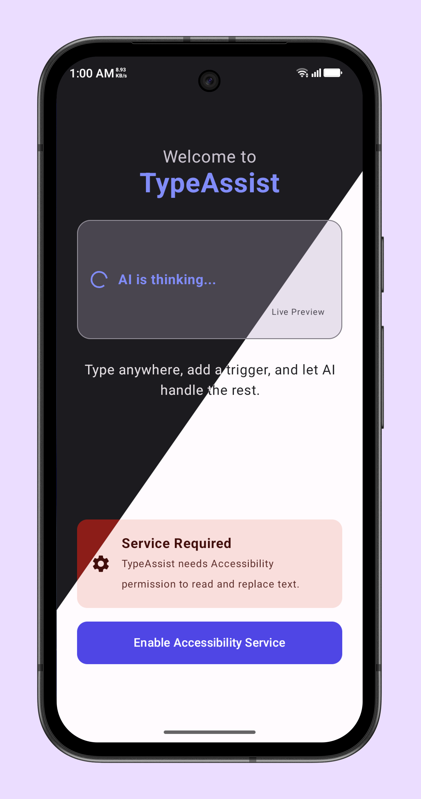
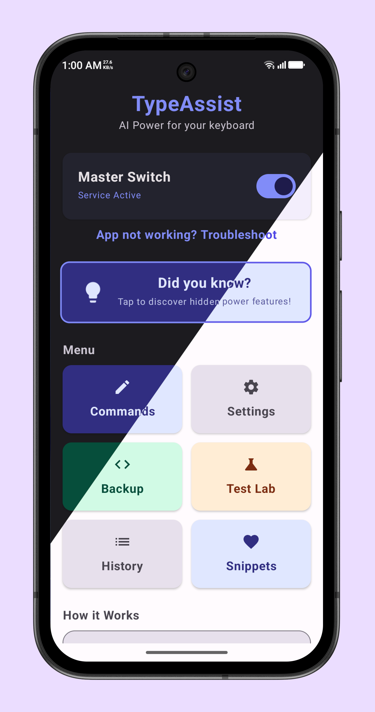
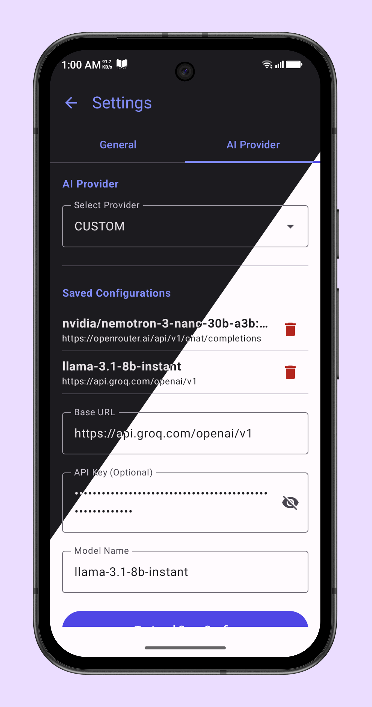

# TypeAssist 🚀

  

  <b>AI & Utility in every Android text field.</b>

  
  
  
  

TypeAssist uses Accessibility to trigger AI actions via simple commands, with support for multiple AI providers.

---

## 📸 Screenshots

  <!-- Screenshots -->
  

    
    
    
  

---

## ✨ Features

### 🤖 AI Capabilities
*   **Ask AI:** Query Google Gemini, Cloudflare Workers AI, or **any OpenAI-compatible Custom API** directly from any app.
*   **Grammar Fix:** Instantly correct spelling, punctuation, and grammar errors.
*   **Translation:** Translate text from any language to English (or your preferred language).
*   **Tone Adjustment:** Rewrite messages to be more professional, polite, or friendly.
*   **Inline Commands:** Embed AI queries within sentences using `(.ta: your prompt)`.
*   **Global Rewrite:** Transform the entire text field with a custom instruction using `...instruction...`.
    *   Example: `meeting at 3pm, bring laptop ...expand to formal invite...`
    *   **Result:** "Please join us for a meeting at 3:00 PM. Kindly remember to bring your laptop as we will be working through some examples together."

### 🛠 Utility Belt (Offline Tools)
*   **Smart Calculator:** Solve math expressions in-place.
    *   Example: `(.c: 25 * 4 + 10)` -> `110`
*   **Snippets (Text Expander):** Expand shortcuts into full text blocks.
    *   Example: `..email` -> `user@example.com`
    *   **Quick Save:** Save new snippets instantly without opening the app: `(.save:trigger:content)`
*   **Date & Time:** Insert current timestamps with `.now` or `.date`.
*   **Password Generator:** Generate strong random passwords on the fly with `.pass`.

### 💾 Data Management
*   **Backup & Restore:** Securely export your settings, snippets, and API configurations to a `.tabak` file.
*   **Saved Configurations:** Save and switch between multiple API setups (e.g., "Personal Gemini", "Work Custom API").

### 🛡 Safety & Privacy
*   **Global Undo:** Revert any action instantly using `.undo`.
*   **History Manager:** View and recover original text from the last 5 minutes.
*   **Privacy First:** Processes text **only** when a trigger is detected. No data is stored permanently.

---

## 📖 Usage Guide

### Standard Triggers
Type your text followed by a trigger to process it.

| Trigger | Action | Example |
| :--- | :--- | :--- |
| `.ta` | Ask AI | `Population of Tokyo? .ta` |
| `.g` | Fix Grammar | `i go home yestarday .g` |
| `.tr` | Translate | `你好世界 .tr` |
| `.polite` | Polite Tone | `Give me the money .polite` |
| `...` | Global Rewrite | `I am late ...make polite...` |
| `.undo` | Undo | Reverts the last replacement |

---

## 📥 Installation & Setup

1.  **Download:** Get the latest APK from the [Releases](https://github.com/estiaksoyeb/TypeAssist/releases) page.
    *   
2.  **Permissions:** Enable the **TypeAssist Accessibility Service** in your Android Settings.
3.  **API Key:** Open the app, go to **Settings**, and add your API keys.
    *   Supports Google Gemini, Cloudflare Workers AI, and Custom OpenAI Endpoints.
4.  **Start Typing:** Open any app (WhatsApp, Notes, Chrome) and try a trigger!

---

## 🤝 Support Development

If TypeAssist helps you in your daily workflow, consider supporting the development! Since traditional payment methods like PayPal are unavailable in my region, I accept donations via Binance and Cryptocurrency.

**Preferred Method (Zero Fees):**
*   **Binance Pay ID:** `724197813`

**Other Cryptocurrencies:**
*   **USDT (TRC20):** `TPP5S7HdV4Hrrtp5Cjz7TNtttUAfZXJz5a`
*   **TRX (Tron):** `TPP5S7HdV4Hrrtp5Cjz7TNtttUAfZXJz5a`

*Every bit helps keep this project open-source and covers the maintenance costs.*

---

## 🛠 Tech Stack
*   **UI:** Jetpack Compose (Material 3)
*   **Language:** Kotlin 2.1.0
*   **Network:** OkHttp / Gson
*   **Service:** Android AccessibilityService
*   **Architecture:** MVVM

---

## 📜 License
Distributed under the **GPLv3 License**. See `LICENSE` for more information.

---

## 🔒 Privacy & Data Security

TypeAssist is designed with a **Zero-Middleman Architecture** to ensure your privacy is paramount.

### How We Handle Data
*   **Direct Connection:** Text is sent **directly** from your device to your chosen API provider (Google or Cloudflare). **No intermediate servers** are used, meaning we have no access to your data.
*   **On-Demand Only:** The Accessibility Service runs locally. No data leaves your device unless you explicitly type a trigger (e.g., `.ta`, `.g`).
*   **Open Source:** The entire codebase is open for audit. You can verify exactly how your data is handled.

### 📜 Provider Policies
Your input data is processed by the provider you configure. Please review their policies:
*   **Google Gemini:** [API Terms of Service](https://ai.google.dev/gemini-api/terms)
*   **Cloudflare Workers AI:** [Data Usage & Privacy](https://developers.cloudflare.com/workers-ai/platform/data-usage/)